<div align="center">

<picture>
  <source media="(prefers-color-scheme: dark)" srcset="assets/hero-dark.svg">
  <source media="(prefers-color-scheme: light)" srcset="assets/hero-light.svg">
  
</picture>

<picture>
  <source media="(prefers-color-scheme: dark)" srcset="assets/typing-dark.svg">
  <source media="(prefers-color-scheme: light)" srcset="assets/typing-light.svg">
  
</picture>


</div>

<br>

<div align="center">

<picture>
  <source media="(prefers-color-scheme: dark)" srcset="assets/whoami-dark.svg">
  <source media="(prefers-color-scheme: light)" srcset="assets/whoami-light.svg">
  
</picture>

<br><br>

<em>Turning political and legal questions into computational research.</em>

</div>

<br>

### ◌ Research stack

```bash
$ cat research-stack.yaml
```

```yaml
legal_research:
  - international law
  - law & emerging technology
political_science:
  - international relations
  - political data
space_policy:
  - astropolitics
  - space governance & sovereignty
computational_methods:
  - Python · pandas · NumPy
  - FastAPI · SQLModel · PostgreSQL
  - pytest · Docker
  - Git · GitHub · GitHub Actions
scientific_visualization:
  - Plotly · Streamlit
  - Astro · TypeScript · SVG
emerging_technology:
  - AI governance
  - strategic & orbital infrastructure
```

<div align="center">

<picture>
  <source media="(prefers-color-scheme: dark)" srcset="assets/languages-dark.svg">
  <source media="(prefers-color-scheme: light)" srcset="assets/languages-light.svg">
  
</picture>

<sub>Languages most used across my public repositories · refreshed weekly by a GitHub Action</sub>

</div>

<br>

### ✦ Research constellation

<div align="center">

<picture>
  <source media="(prefers-color-scheme: dark)" srcset="assets/orbital-research-dark.svg">
  <source media="(prefers-color-scheme: light)" srcset="assets/orbital-research-light.svg">
  
</picture>

</div>

<br>

### ⌁ Telemetry

<div align="center">

<picture>
  <source media="(prefers-color-scheme: dark)" srcset="assets/telemetry-dark.svg">
  <source media="(prefers-color-scheme: light)" srcset="assets/telemetry-light.svg">
  
</picture>

</div>

<br>

### ◎ Research directory

```bash
$ ls ~/research
```

```text
research/
│
├── astropolitics/
│   ├── space_governance
│   ├── sovereignty
│   └── cosmic_capitalism
│
├── computational_social_science/
│   ├── political_data
│   ├── network_analysis
│   └── research_visualization
│
├── law_and_technology/
│   ├── ai_governance
│   ├── strategic_technologies
│   └── emerging_regulation
│
└── open_research/
    ├── datasets
    ├── reproducible_methods
    └── interactive_tools
```

<sub>A conceptual map of research interests, not a list of physical directories.</sub>

<br>

### ☄ Current research

**Astropolitics & Space Governance** — how sovereignty, property and authority are being redefined beyond Earth, and who writes the rules for orbit and the commons of outer space.

**Computational Research** — translating legal and political concepts into datasets, indicators and reproducible code, so that theoretical claims can be examined openly.

**Space & Strategic Technologies** — satellites, digital infrastructure and AI as instruments of power, and the dependencies they create between states.

**Global South Perspectives** — reading space and technology governance from Latin America and the Global South, where dependency and access are central rather than peripheral questions.

<br>

### ⎇ Git log

```bash
$ git log --oneline --research
```

```text
→ investigating emerging forms of sovereignty
→ translating theory into computational methods
→ building open scientific visualizations
→ exploring space governance and astropolitics
→ studying technology as a political and legal frontier
```

<br>

### ◌ Signals

<div align="center">

[**Website**](https://laurapamelaarandamedrano-dot.github.io/pamelaaranda.github/) &nbsp;·&nbsp; [**GitHub**](https://github.com/laurapamelaarandamedrano-dot)

</div>

<br>

<div align="center">


</div>

<br>

<div align="center">

<picture>
  <source media="(prefers-color-scheme: dark)" srcset="assets/footer-dark.svg">
  <source media="(prefers-color-scheme: light)" srcset="assets/footer-light.svg">
  
</picture>

</div>
